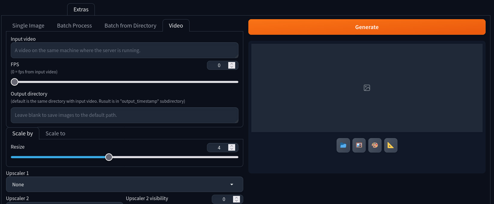

# Video in Extras tab

This extenstion for [AUTOMATIC1111/stable-diffusion-webui](https://github.com/AUTOMATIC1111/stable-diffusion-webui) adds new tab inside `Extras` tab to process video frame by frame. Useful if you want to use any specific extension, like my [sd-webui-cn-in-extras-tab](https://github.com/light-and-ray/sd-webui-cn-in-extras-tab), [sd-webui-color-correction-extras](https://github.com/light-and-ray/sd-webui-color-correction-extras), w-e-w's [sd-webui-nudenet-nsfw-censor](https://github.com/w-e-w/sd-webui-nudenet-nsfw-censor)

Or even a lazy way to upscale video, restore faces, [reactor](https://github.com/Gourieff/sd-webui-reactor) faceswapping, etc
